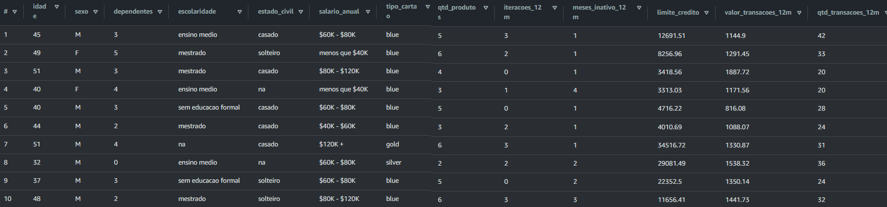
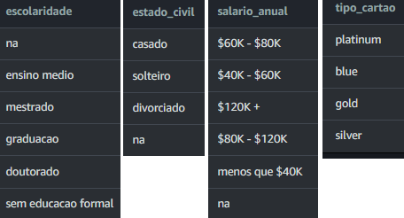
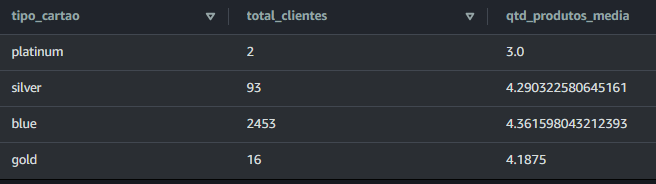
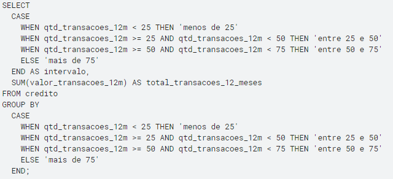
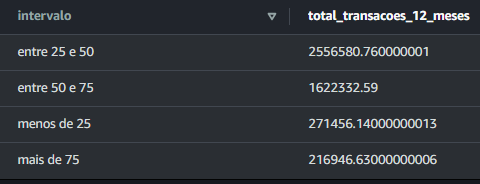
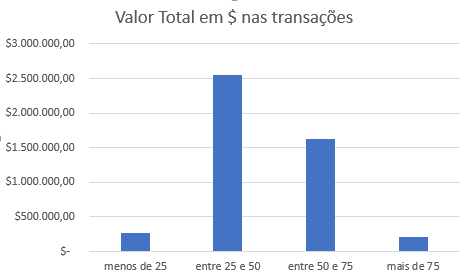
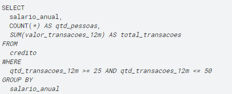
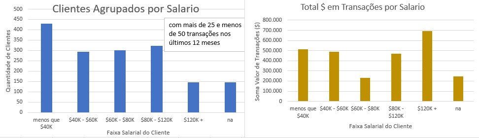

# Análise Exploratória de Dados de Crédito com SQL
## Desvendando o Potencial do Mercado: EDA  de Clientes de um Banco para Crédito

## Dados da tablea:

Os dados representam informações de clientes de um banco e contam com as seguintes colunas:
A tabela foi criada no AWS Athena junto com o S3 Bucket com uma versão dos dados disponibilizados no [link](https://github.com/andre-marcos-perez/ebac-course-utils/tree/main/dataset)

Exploração de dados extraidos do dataset: [link](https://github.com/andre-marcos-perez/ebac-course-utils/blob/main/dataset/credito.csv)

- idade: idade do cliente
- sexo: sexo do cliente (F ou M)
- dependentes: número de dependentes do cliente
- escolaridade: nível de escolaridade do clientes
- salario_anual: faixa salarial do cliente
- tipo_cartao: tipo de cartao do cliente
- qtd_produtos: quantidade de produtos comprados nos últimos 12 meses
- iteracoes_12m: quantidade de iterações/transacoes nos ultimos 12 meses
- meses_inativo_12m: quantidade de meses que o cliente ficou inativo
- limite_credito: limite de credito do cliente
- valor_transacoes_12m: valor das transações dos ultimos 12 meses
- qtd_transacoes_12m: quantidade de transacoes dos ultimos 12 meses

## Fase exploratoria:

Como o banco de dados original tem 10128 linhas, diminuiremos os custos do derviço Athena utilizando uma amostra representativa disponibilizada pela profissional Mariane Neiva.

Tamanho do banco de dados: Query: SELECT count(*) FROM credito

Reposta: 2564 linhas (representa pouco mais do 25%)

É criada uma tabela no Athena definindo o tipo de dado de cada coluna. Conferimos os primeiros dados da tabela: SELECT * FROM credito LIMIT 10

Esta vista previa serve para ter uma ideia da qualidade dos dados e se percebe que dependenod do tipo de análise poderia ser necessario um tratamento já que encontramos valores nulos.

Para ter uma ideia dos diferentes valores que podemos encontrar em algumas colunas que achamos interessante usamos a seguinte query: SELECT DISTINCT nome_coluna FROM credito

(onde nome_coluna é o nome da coluna da tabela que vamos relacionar na seguinte imagem)

Para ter uma relação de quantos nulos temos e ver se é uma cantidad consideravel utilizamos a seguinte query (em este caso os valores nulos não são campos vazios, estão almacenados na base de dados com o texto 'na')

Quantidade de valores nulos: SELECT COUNT(*) FROM credito WHERE salario_anual = 'na';

Respuesta: escolaridade=346 valores nulos (13,5%)

          estado_civil=116 valores nulos (4,5%)

          salario_anual=235 valores nulos (9,2%)
Podemos apreciar que no campo de escolaridade tem a maior proporção de em que não foram computados os dados seguido pelo campo de salario anual.

## Analisemos o perfil dos clientes

Análise de uso do cartão de crédito: analisando como os clientes estão usando seus cartões de crédito, como o tipo de cartão que possuem e a quantidade de produtos comprados nos últimos 12 meses. Isso pode ajudar a identificar oportunidades para aumentar o uso do cartão de crédito, como oferecer incentivos para os clientes usarem mais o cartão ou criar programas de fidelidade.

Pode verse que é significativamente maior a quantidade de clientes que usam o cartão blue, podendo sugerir alterações nos outros programas para tornarem eles mais atrativos para os clientes. Tambem poderiamos ver programas para incentivar mais o uso do cartão platinum que aparentemente não é muito utilizado

Análise de atividade financeira: examinamos as transações e a atividade financeira dos clientes nos últimos 12 meses, incluindo a quantidade de transações, o valor total das transações e os meses inativo. Isso pode ajudar a identificar padrões de comportamento do cliente e identificar oportunidades para oferecer produtos financeiros adicionais ou serviços personalizados. Consultando o valor máximo e mínimo dividimos os clientes em 5 grupos dependendo a quantidade de transações: os que tem "menos de 25", "entre 25 e 50", "entre 50 e 75" e "maior de 75". query:

Esta consulta pode ajudar a identificar padrões de comportamento dos clientes e identificar oportunidades para oferecer produtos financeiros adicionais ou serviços personalizados. Principalmente se observa que os que movimentaram mais dinheiro são o grupo que fizeram entre 25 e 50 transações nos ultimos 12 meses.

Aproveitamos pra ver como está composto este grupo entre 25 e 50 transações nos últimos 12 meses. Queremos saber a proporção de renda salarial de esse grupo. query:

Em essa faixa de transações, se percebe que os que mais utilizam o cartão são os de salario menor de USD 40k anual, porem os que menos utilizam o cartão são os de faixa salarial acima de USD 120k e gastam mais em esses 12 meses.

## Conclusão

A grão maioria dos clientes tem cartão blue, estes adqueriram em media 4,4 produtos nos últimos 12 meses.
Os clientes que fizeram entre 25 e 50 transações nos últimos 12 meses são os que mais movimentaram dinheiro nas transações.
Este grupo tem maioritariamente (429) clientes, com salario anual menor a USD 40K e os de menor proporção (146 clientes) são os de salario acima de USD 120k.
Mesmo sendo poucos os que tem salario acima de USD 120k, são eles os que mais dinheiro movimentaram nas transações.
